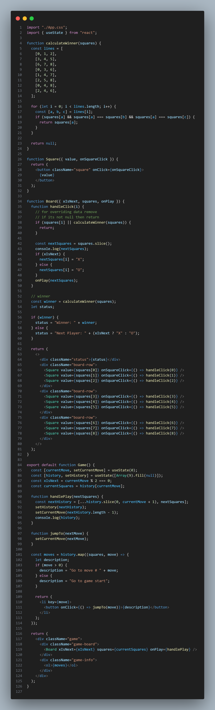

# 30 Days of Learning and Sharing React.js

    

| Resources | Description                                             |
| --------- | ------------------------------------------------------- |
| Udemy     | https://www.udemy.com/course/the-ultimate-react-course/ |
| Docs      | https://react.dev/learn                                 |

## Day 1 of 30 days of React.js

- As i already knew about react and components that i learnt before. I jumped to react official documentation and started to learn by doing, i.e doing project.
- I made a tic-tac toe game with React.js by following docs.
- Skills learnt
  - Components
  - Props
  - State

    

### Output of Day 1 - Tic-Tac Toe game

    

# Day 2 of 30 days of React.js

- I am starting to learn from udemy from this day.
- This is module 3 - working with react components.
- Skills learnt
  - Children props
  - Components

## Code for assignment-I in module 3 = udemy

### Output of Day 2 - Assignment on components

# Day 3 of 30 days of React.js

- This is module 4(React state and working with State) and 5(Rendering list and conditional rendering)
- Skills learnt
  - Stateless/Dumb/Presentational VS Stateful/Smart Components
  - Events and States
  - Lifting the state - child to parent data transfer
  - Controlled(child doesn't have sate nor function all controlled b y parent component) Vs Uncontrolled State
  - Derived Computed State = means using variables to store instead of state , when state store similar value.
  - Handling form submit and two way binding.
  - Conditional Rendering
  - Map() to render list.

## Code for day 3 = udemy

Kindly kind rest of the source code in "./sourcecode/day3/"

### Output of Day 3

# Day 4 of 30 days of React.js

- This is module 7(styling react components) 8(debugging react apps) 9(2 projects for practice)
- Skills learnt
  - Ways of styling project like styled components and modules
  - Debugging skills like breakpoint,
  - Break out of tutorial hell by doing myself with 2 projects

## Code for Dynamic and Inline css

## Code for Styled components

## Code Sample and Output for project 1 (Invest calculator)

## Code Sample and Output for project 2 (User Adder)

# Day 5 of 30 days of React.js

- I learnt about react fragments, useRef hook for forms, useEffect, useReducer
- Skills learnt
  - Why to use react Portals and how.
  - Why to use useRef for forms.
  - useEffect and useReducer hook and why to use useReducer over useState

## React Portals code + output

## When to use useReducer hook Code

## UseEffect hook + useReducer hook Code

## Output for useEffect + useReducer hook

## Sate vs reducer

# Day 6 of 30 days of React.js

- I learnt about Context Hook
- Skills learnt
  - Context i.e context.consumer without hook
  - Context using hooks
  - Context using hooks + dynamic by managing provider as well as state and required functions in one single file.
  - Limitation of context
  - Three rules of Hooks

Kindly find source code in source code directory

## Context without hooks

## Context with hook

## Custom Provider for managing context

## Limitation of Context

## Three rules of Hooks

